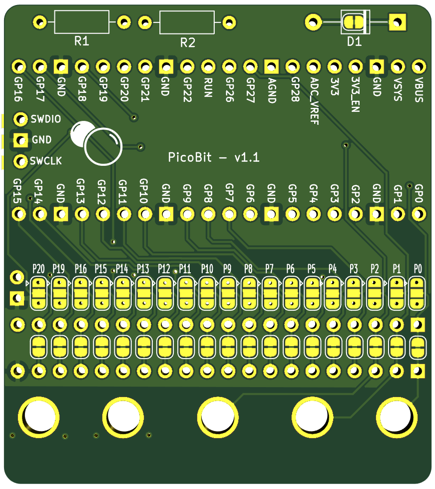

# PicoBit

The PicoBit adapter board for the Raspberry Pi Pico allows you to connect a Pi Pico to micro:bit accessories.
It's also possible to connect the Pico to Raspberry Pi HAT via a micro:bit to Pi adapters  


[comment]: <> (![Front view]&#40;images/picobit/front.png&#41;)

# Features

All micro:bit pins broken out to 2 rows of headers
Each pin out has a solder jumper
2x GND
2x VCC

Thru-holes for i2c pullup resistors (optional)
Thru-holes for back powering prevention diode (optional)


[PIC: front, highlight headers]


[PIC: back, highlight thru-hole i2c]
[PIC: back, highlight thru-hole diode]
[PIC: back, highlight solder jumper]
[PIC: back, highlight high/low]


# Pin Mapping

The default wired pin mapping from Micro:bit edge connector pin to Pi Pico GPIO is:

- P0 = GPIO26
- P1 = GPIO27
- P2 = GPIO28
- P3 = GPIO7
- P4 = GPIO8
- P5 = GPIO22
- P6 = GPIO9
- P7 = GPIO10
- P8 = GPIO11
- P9 = GPIO12
- P10 = GPIO13
- P11 = GPIO17
- P12 = GPIO14 (SPI0 RX)
- P13 = GPIO18 (SPI0 TX)
- P14 = GPIO16
- P15 = GPIO19
- P16 = GPIO15
- P19 = GPIO21 (I2C0)
- P20 = GPIO20 (I2C0)


The mapping can be changed by cutting solder bridges on the underside of the board and adding patch wires to the top or bottom, optionally using additonal female headers.


[comment]: <> (![Back view]&#40;images/picobit/back.png "Back view"&#41;)



# Examples

## Circuit Python

There is a dedicated [README](circuitpython/README.md) for the CircuitPython examples.

Note that there is a Micro:bit Compatibility API, these examples demonstrate the:

- Kitronik GameZip (Pong)
- Kitronik Klef 
- ProtoPic Simon Says
- ProtoPic MicroPixel Edge


## Arduino Examples

### Installation

Copy the `arduino/Picobit` folder to `[ARDUINO_SKETCHES]/libraries/`

Start (or restart) the Arduino IDE.

In the Arduino IDE goto:  
`File -> Examples -> "Examples from Custom Libraries -> PicoBit"`

And select an example.


## Pico C Examples

Ensure you have setup the Raspberry Pi Pico SDK first.   

The examples assume the SDK has been installed into:  `~/pico/pico-sdk`


### SPI Display (ST7735) - PIO

This example is based on code from [REF] and displays colour bars.
The SPI communication is performed via PIO.

```
export PICO_SDK_PATH=~/pico/pico-sdk
cd c/examples/spi_display
mkdir build
cd build
cmake ..
make -j
cp spi_display.uf2 /Volumes/RPI-RP2/
```


### SPI Display (ST7735) - Pico SDK SPI API

TODO: https://github.com/bablokb/pico-st7735

