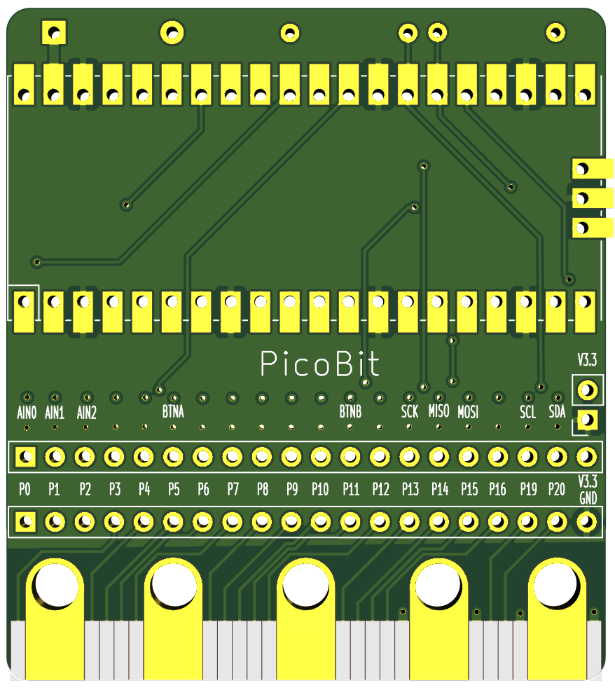

# PicoBit

The PicoBit adapter board for the Raspberry Pi Pico allows you to connect a Pi Pico to micro:bit accessories.
It's also possible to connect the Pico to Raspberry Pi HAT via a micro:bit to Pi adapters  

Front

[comment]: <> (![Front view]&#40;images/picobit/front.png&#41;)

Back

[comment]: <> (![alt text]&#40;images/picobit/back.png "Back view"&#41;)

Quick examples

# Features

All micro:bit pins broken out to 2 rows of headers
Each pin out has a solder jumper
2x GND
2x VCC

Thru-holes for i2c pullup resitors (optional)
Thru-holes for back powering prevention diode (optional)

[PIC: front, highlight headers]

[PIC: back, highlight thru-hole i2c]
[PIC: back, highlight thru-hole diode]
[PIC: back, highlight solder jumper]
[PIC: back, highlight high/low]

# Pinout

# Pin mapping

# Examples

## Circuit Python

### Micro:bit Compatibility API

- Kitronik GameZip (Pong)
- Kitronik Klef 
- ProtoPic Simon Says
- ProtoPic MicroPixel Edge

## Arduino
## C

# Raspberry Pi HATS

- Pimoroni PianoHat     

